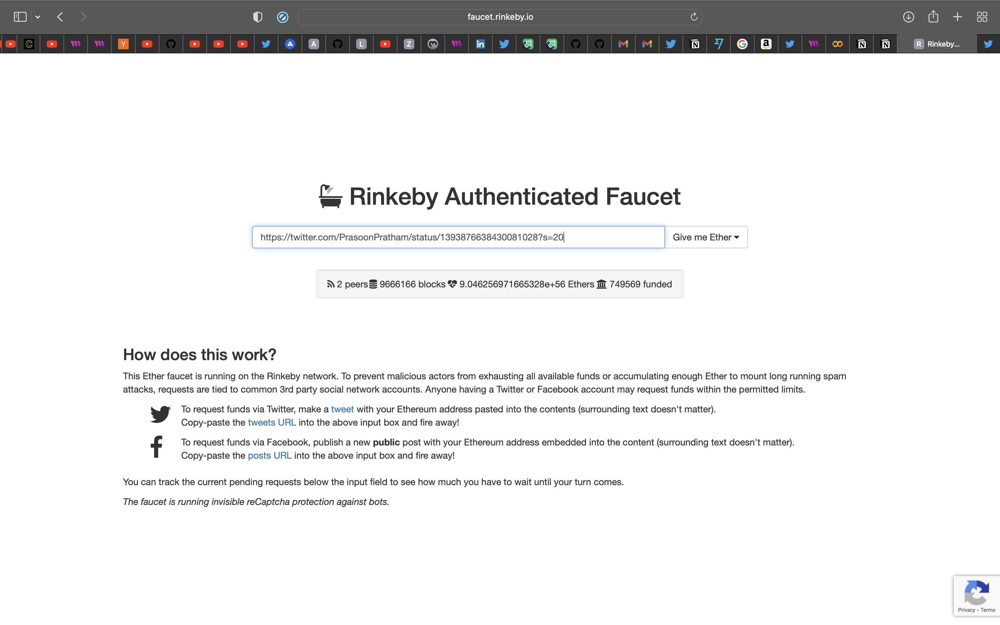

## Intro

In this guide we'll create a wallet and export the private key. So if you don't have a wallet, make sure to sign up with **MetaMask** or **CoinWallet**.

### Create a Project and Module

Head over to [MetaMask](https://metamask.io/download.html) and download the extension.


After downloading and installing MetaMask, the following screen should pop-up.


You can either log in to your existing wallet with your `Secret Recovery Phrase` or create a new wallet. We'll go ahead and create a new wallet.


Choose whether you want to share data with MetaMask or not. Up to you...


Create a password. The password should be minimal 8 characters. Make sure to add numbers, special signs and capital letters.


A `Secret Recovery Phrase` is the key to your wallet. Make sure you save your `Secret Recovery Phrase` properly.


Here is an example of a `Secret Recovery Phrase`. This is not the same as your `Private Key`. The `Secret Recovery Phrase` is used to login to your wallet from any device, and the Private Key is used to interact with your wallet when developing applications (think of it as admin access)


You will be asked to confirm your `Secret Recovery Phrase`. You need to pick the exact order as shown before.


Congratulations! You created a wallet!


## Export your private key

You should be logged into MetaMask inside your browser. Head over to the top right corner and click on the three dots and then click on **Account details**


The following screen should pop-up. Click on **Export Private Key**.


MetaMask will ask you for your password. Fill in your password and click **Confirm**.


After filling in your password, your `Private Key` will be exposed. Be aware. Don't share your `Private Key` with anyone or else they can execute transactions from your wallet and access your funds.


## Hiding & Setting the Private Key with Python

So your wallet has a private key. We will need that to make sure any transaction is done from this wallet. This is where the sdk uses your wallet.

Create a `.env` file in the same folder as the project. Open the `.env` file in your code editor and paste your private key inside a variable called 'PRIVATE_KEY'.

```python:.env
PRIVATE_KEY = '1234OUI132UIO5YAZKSJFDGIO'
```

```python
#use the '.env' file inside Python in the same folder
load_dotenv("./.env")
'PRIVATE_KEY = os.getenv('PRIVATE_KEY')'.

#over here we connect our wallet via the private key stored in the '.env' file
sdk.set_private_key("PRIVATE_KEY")
```

## Hiding & Setting the Private Key with JavaScript / TypeScript

```python:.env
PRIVATE_KEY = '1234OUI132UIO5YAZKSJFDGIO'
```

Install the dotenv module:

```bash
npm i dotenv
```

```jsx
//Import the private key, by putting this at the start of your file
require("dotenv").config();
```

## Getting ETH on Rinkeby Testnet

In order to execute transactions we need ETH to pay for gas, but paying for ETH on mainnet is quite expensive! Luckily we can make use of so called 'testnets'. Testnets are networks that operate and behave just like the mainnet. So we can deploy our smart contracts on the testnet and test it before we actually deploy our smart contract.

We can switch between networks inside our wallet by clicking the current network located at the top.

To get test ETH, you need to tweet [this](https://twitter.com/intent/tweet?text=Requesting%20faucet%20funds%20into%200x0000000000000000000000000000000000000000%20on%20the%20%23Rinkeby%20%23Ethereum%20test%20network.), replacing it with your public wallet address 👇🏻


Then, head over to [](https://faucet.rinkeby.io/) and paste the link to your tweet in the input field.



After a couple of minutes you'll receive some free ETH so you can start developing your applications.
