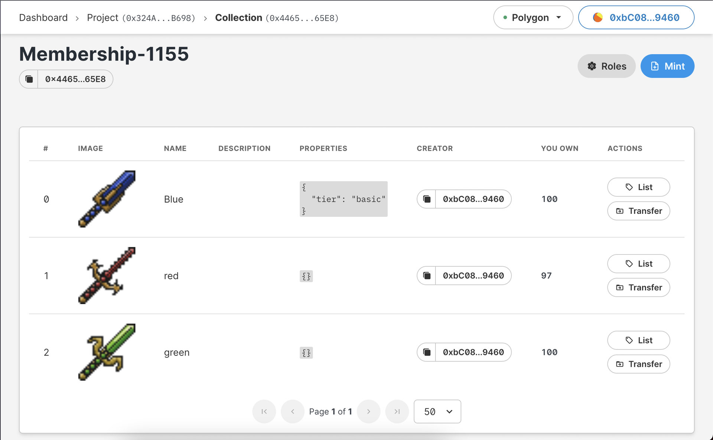

A few examples:

- Large NFT collections which grant every holder access to a private community (ie. [Bored Ape Yacht Club](https://opensea.io/collection/boredapeyachtclub))
- Smaller NFT collections which grant holders lifetime access to an existing paid community ([Shiny Magpies](https://opensea.io/collection/shiny-magpies))

## Setup NFT

1. Go to [https://thirdweb.com/dashboard](/dashboard), connect your wallet and select the network you want to deploy to.
2. Create new project (if you don't have one).
3. Add a module: _NFT Collection (ERC 1155)_.
4. Add a name and description for your collection. (This will be displayed when users view the collection page on Opensea).
5. Click Deploy → confirm both steps in your wallet.
6. Click **Mint** on the top right corner to start minting your Membership NFT.
7. Add a name and description for your individual NFT. (This will be displayed when users view the individual NFT page on OpenSea).
8. You can mint multiple NFT's which represent different tiers of membership.
9. Your NFTs have now been minted, and after a few minutes will appear on Opensea under your collection.

**[0x4465...65EB]** is your NFT contract address.

## Discord Setup

We'll be using the [collab.land](https://collab.land) Discord bot. More details can be found on the [collab.land](https://collab.land) website.

1. Invite the bot into your server using this [Invite Link](https://discord.com/oauth2/authorize?client_id=704521096837464076&scope=bot&permissions=8).
2. In the **#collabland-config** channel, send the message `!setup role` to set up a role based on NFT ownership.
3. Choose the network which you used to mint your NFT's — whichever network you're connected to on **thirdweb** where you setup your Project and Module. (Polygon, Mainnet, etc)
4. select ⚖️ for `Collection (ERC1155)`
5. Input the details of the NFT you'd like to grant access to the channel.
   1. `contract address` can be found in your dashboard under your NFT collection name. It looks like **[0x4465...65E8]** in the screenshot above.
   2. `token id` can be found at the top of each NFT. It looks like **#0**, **#1**, **#2**, etc.

## 🎊 That's all! NFT holders can now access private channels

When your community member joins the discord, they need to send `!join` to get set up with [collab.land](https://collab.land).
After setting up with the bot, they will be granted roles which unlock access to the chosen channels based off the chosen NFTs in their wallet.
